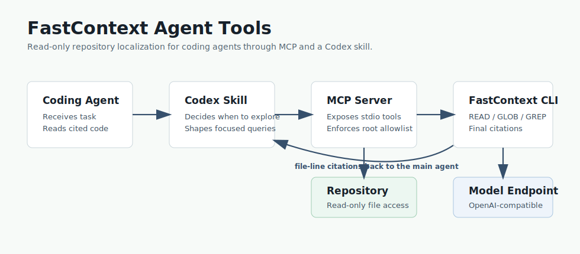

# FastContext Agent Tools

MCP server and Codex skill for using Microsoft's FastContext as a read-only
repository exploration subagent.



FastContext answers one narrow question for a coding agent:

> Which files and line ranges should the main agent inspect before solving this task?

This repository provides the integration layer:

- `fastcontext-mcp`: a Python stdio MCP server with no runtime dependencies.
- `skills/fastcontext-explorer`: a Codex skill that teaches an agent when to delegate repository exploration.
- Evaluation artifacts for the wrapper layer.
- MCP setup guides in English, Traditional Chinese, and Japanese.

It does not bundle model weights, run inference, or modify repositories. The MCP
server calls the upstream `fastcontext` CLI and returns candidate file-line
citations for the main agent to verify.

## One-Line LLM Agent Install Prompt

Ask an LLM agent:

> Install FastContext Agent Tools from `https://github.com/Jakevin/fastcontext-agent-tools`, run `python -m pip install -e .`, configure `python -m fastcontext_mcp` as a stdio MCP server with `BASE_URL`, `MODEL`, `API_KEY`, and `FASTCONTEXT_ALLOWED_ROOTS`, then enable `skills/fastcontext-explorer`.

## Why This Exists

Microsoft FastContext separates repository exploration from code solving. The
upstream project describes a dedicated explorer that uses read-only `READ`,
`GLOB`, and `GREP` tools, issues parallel tool calls, and returns compact
`<final_answer>` citations. Microsoft reports Mini-SWE-Agent integration gains
of up to 5.5 score improvement and up to 60% main-agent token reduction.

Primary sources:

- Microsoft FastContext: <https://github.com/microsoft/fastcontext>
- Model card: <https://huggingface.co/microsoft/FastContext-1.0-4B-SFT>
- Paper: <https://arxiv.org/abs/2606.14066>

## Quick Install

```bash
git clone https://github.com/Jakevin/fastcontext-agent-tools
cd fastcontext-agent-tools
python -m pip install -e .
python -m fastcontext_mcp --print-health
```

If your Python scripts directory is on `PATH`, `fastcontext-mcp --print-health`
works too.

## Requirements

- Python 3.10+ for this MCP wrapper.
- Python 3.12+ for the upstream FastContext CLI.
- The upstream FastContext CLI installed from <https://github.com/microsoft/fastcontext>.
- An OpenAI-compatible endpoint serving a FastContext-compatible model.

Typical upstream setup:

```bash
git clone https://github.com/microsoft/fastcontext
cd fastcontext
uv tool install .
```

Endpoint environment:

```bash
export BASE_URL="http://127.0.0.1:30000/v1"
export MODEL="microsoft/FastContext-1.0-4B-SFT"
export API_KEY="your-api-key"
export FASTCONTEXT_ALLOWED_ROOTS="/path/to/repos"
```

`FASTCONTEXT_ALLOWED_ROOTS` is an `os.pathsep` separated allowlist. If unset,
the MCP server only allows repositories under the directory where the server was
started.

## MCP Configuration

Example stdio config:

```json
{
  "mcpServers": {
    "fastcontext": {
      "command": "python",
      "args": ["-m", "fastcontext_mcp"],
      "env": {
        "BASE_URL": "http://127.0.0.1:30000/v1",
        "MODEL": "microsoft/FastContext-1.0-4B-SFT",
        "API_KEY": "your-api-key",
        "FASTCONTEXT_ALLOWED_ROOTS": "/path/to/repos"
      }
    }
  }
}
```

Localized MCP guides:

- Traditional Chinese: [docs/mcp.zh-TW.md](docs/mcp.zh-TW.md)
- Japanese: [docs/mcp.ja.md](docs/mcp.ja.md)

## MCP Tools

### `fastcontext_health`

Checks whether the wrapper can find the upstream `fastcontext` CLI and whether
the endpoint environment is set.

### `fastcontext_explore`

Runs FastContext against a repository and returns parsed citations plus raw
output.

```json
{
  "repo_path": "/path/to/repo",
  "query": "Locate the request validation logic for uploaded files",
  "max_turns": 6,
  "citation": true,
  "timeout_seconds": 300
}
```

### `fastcontext_explore_with_trace`

Same as `fastcontext_explore`, but saves a FastContext JSONL trajectory. Relative
`trajectory_path` values are resolved inside `repo_path`.

## Codex Skill

The bundled skill lives at:

```text
skills/fastcontext-explorer
```

Install by copying or symlinking that folder into your Codex skills directory:

```bash
mkdir -p "${CODEX_HOME:-$HOME/.codex}/skills"
ln -s "$(pwd)/skills/fastcontext-explorer" "${CODEX_HOME:-$HOME/.codex}/skills/fastcontext-explorer"
```

Use the skill when a coding task requires repository localization before
editing. FastContext citations are candidate evidence; the main agent should
still read the cited files before changing code.

## Evaluation


Wrapper evaluation is repeatable:

```bash
python evaluation/run_wrapper_eval.py
```

Current committed result:

- 2 checks total.
- 2 checks passed.
- 0 checks failed.

Artifacts:

- Evaluation notes: [docs/EVALUATION.md](docs/EVALUATION.md)
- Result JSON: [evaluation/wrapper-eval.json](evaluation/wrapper-eval.json)
- Full report: [docs/REPORT.md](docs/REPORT.md)

The local evaluation uses a fake upstream `fastcontext` CLI so it can validate
the MCP wrapper without a GPU or model endpoint. FastContext model-quality
claims are attributed to Microsoft FastContext and are not reproduced here.

## Development

Run tests:

```bash
PYTHONPATH=src python -m unittest discover -s tests
```

Validate the bundled Codex skill:

```bash
python /path/to/skill-creator/scripts/quick_validate.py skills/fastcontext-explorer
```

Run the wrapper evaluation:

```bash
python evaluation/run_wrapper_eval.py
```

## Safety Notes

- The MCP server exposes no edit/write tools.
- `repo_path` must resolve under `FASTCONTEXT_ALLOWED_ROOTS`.
- Secrets are read from environment variables only.
- Trajectories are written only when requested.

## License

MIT

