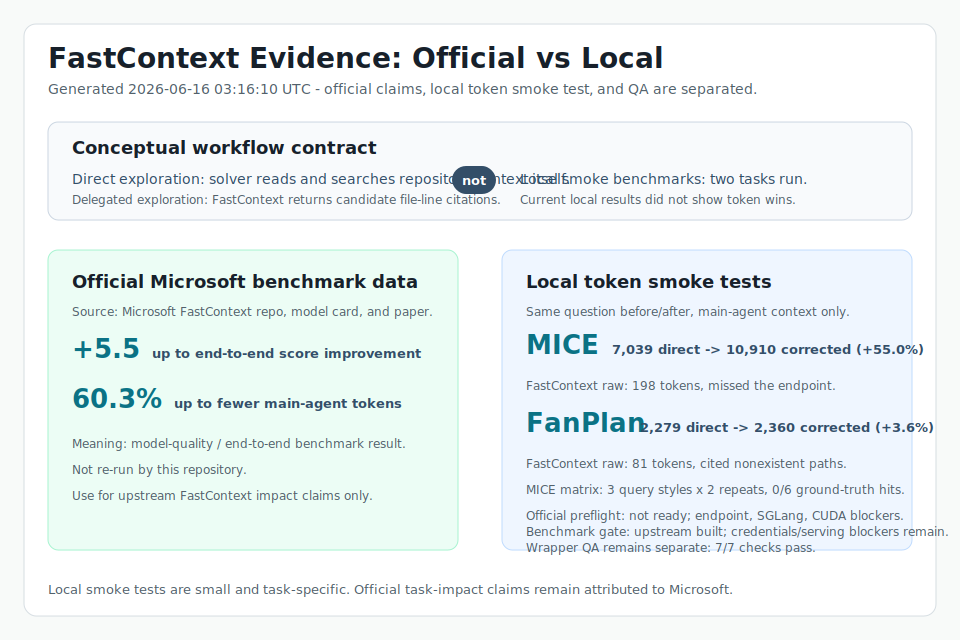

# Evaluation

This project has two evaluation layers:

1. Wrapper evaluation for this MCP server and Codex skill package.
2. Model-quality evidence from the upstream Microsoft FastContext project.



The summary image is intentionally split by data source:

- Official Microsoft FastContext benchmark data.
- Local wrapper measurements from this repository.

## Local Wrapper Evaluation

The repeatable local check is:

```bash
python -m evaluation.run_wrapper_eval
```

Last checked result committed in `evaluation/wrapper-eval.json`:

| Check | Result | Evidence |
| --- | --- | --- |
| Unit tests | PASS | Runs 13 tests covering parser, runtime, server, and wrapper behavior |
| MCP initialize | PASS | Starts the stdio server and completes JSON-RPC `initialize` |
| MCP tool discovery | PASS | Verifies `tools/list` exposes `fastcontext_health`, `fastcontext_explore`, and `fastcontext_explore_with_trace` |
| Health uses bundled CLI | PASS | Verifies `fastcontext_health` reports `fastcontext_mcp.fastcontext_cli` as the command module |
| Citation parsing | PASS | Runs `fastcontext_explore` through a fake FastContext CLI and parses two file-line citations |
| Trace output | PASS | Runs `fastcontext_explore_with_trace` and verifies the trajectory file is written inside the repo |
| Path allowlist guard | PASS | Calls a repo outside `FASTCONTEXT_ALLOWED_ROOTS` and verifies it is rejected |

Scope:

- MCP protocol basics: `initialize`, `tools/list`, and `tools/call`.
- Tool contract: `fastcontext_health`, `fastcontext_explore`, and `fastcontext_explore_with_trace`.
- Citation parsing from a FastContext-style `<final_answer>` block.
- Read-safety guard through `FASTCONTEXT_ALLOWED_ROOTS`.
- Trace file creation when `trajectory_path` is supplied.

Limitation:

- This wrapper evaluation uses a fake `fastcontext.cli` package so it can run without a GPU or model endpoint.
- It proves the integration wrapper, not FastContext model quality.

## Upstream Model Evidence

The model-quality claims should be attributed to Microsoft FastContext:

- Project: <https://github.com/microsoft/fastcontext>
- Model card: <https://huggingface.co/microsoft/FastContext-1.0-4B-SFT>
- Paper: <https://arxiv.org/abs/2606.14066>

Microsoft reports that FastContext is a lightweight repository-exploration subagent using read-only `READ`, `GLOB`, and `GREP` tools, returning compact file-line citations. Their reported Mini-SWE-Agent integration results include up to 5.5 score improvement and up to 60.3% main-agent token reduction across SWE-bench Multilingual, SWE-bench Pro, and SWE-QA.

This repository does not re-run those benchmarks. Reproducing them requires the upstream benchmark harness, task datasets, and configured main-agent and FastContext model endpoints.
